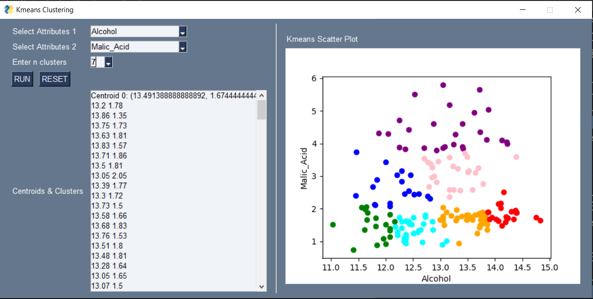

# Data Clustering Program AI
This a data clustering Python program created with PyGame. It takes a csv file as input and produces a scatterplot and centroids data based on users' chosen attributes. It is one of my laboratory exercises in my AI course during my junior year.

